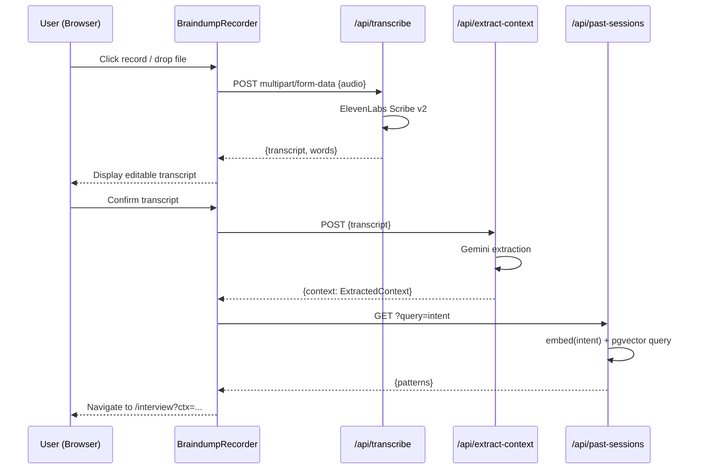
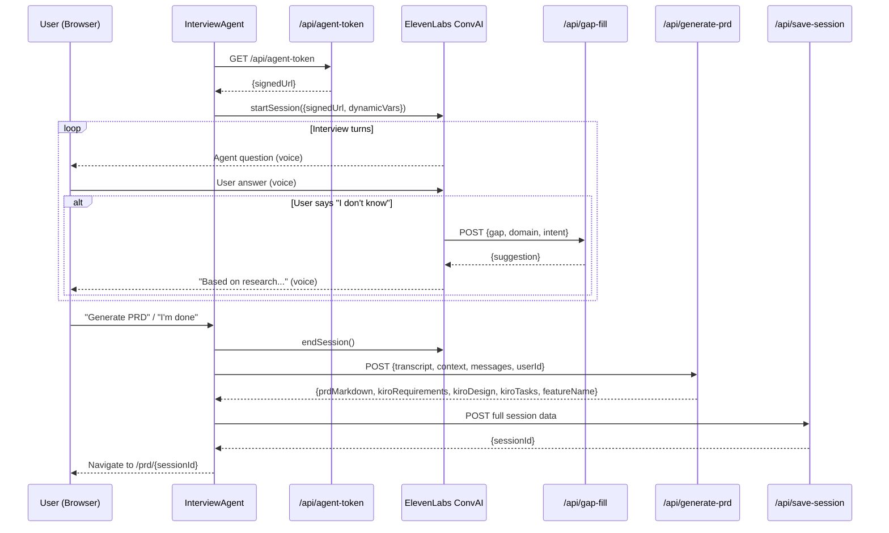
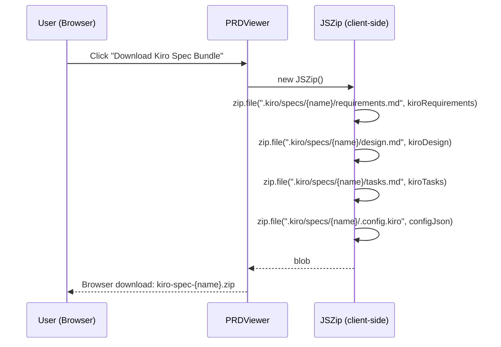

# Design Document

## Overview

SpecDraft is a voice-first AI product copilot built on Next.js 16 (App Router), React 19, and Tailwind 4. It guides a user from a raw audio brain-dump through a conversational AI interview to a fully structured PRD and a Kiro-compatible spec bundle. The system is stateless at the HTTP layer — all persistent state lives in NeonDB — and is deployed as a serverless application on Vercel.

The existing scaffold provides the transcription API route and the database schema. This design covers everything that must be built on top of that foundation.

---

## Architecture Overview

```
┌─────────────────────────────────────────────────────────────────┐
│                    NEXT.JS 16 APP (VERCEL)                       │
│                                                                 │
│  Pages (App Router)                                             │
│  ├── /                    ← Landing + Brain-Dump Intake         │
│  ├── /interview           ← ConvAI Interview Screen             │
│  └── /prd/[sessionId]     ← PRD Preview + Export               │
│                                                                 │
│  API Routes                                                     │
│  ├── POST /api/transcribe        (exists)                       │
│  ├── POST /api/extract-context   (new)                          │
│  ├── GET  /api/agent-token       (new)                          │
│  ├── POST /api/gap-fill          (new)                          │
│  ├── POST /api/generate-prd      (new)                          │
│  ├── POST /api/save-session      (new)                          │
│  └── GET  /api/past-sessions     (new)                          │
│                                                                 │
│  Components                                                     │
│  ├── BraindumpRecorder.tsx                                      │
│  ├── FileUploadZone.tsx                                         │
│  ├── WaveformVisualizer.tsx                                     │
│  ├── InterviewAgent.tsx                                         │
│  └── PRDViewer.tsx                                              │
│                                                                 │
│  Lib                                                            │
│  ├── gemini.ts            ← @google/genai singleton             │
│  ├── elevenlabs.ts        ← ElevenLabsClient singleton          │
│  ├── embeddings.ts        ← embed() + ragQuery()                │
│  ├── prd-assembler.ts     ← PRD generation pipeline             │
│  └── kiro-spec-generator.ts ← Kiro bundle builder              │
└──────────────────┬──────────────────────────────────────────────┘
                   │
     ┌─────────────┼──────────────┐
     │             │              │
┌────▼───────┐ ┌───▼──────┐ ┌────▼──────────────┐
│ ElevenLabs │ │  Gemini  │ │ NeonDB (Postgres)  │
│ Scribe v2  │ │ @google/ │ │ + pgvector         │
│ ConvAI 2.0 │ │  genai   │ │ + Drizzle ORM      │
└────────────┘ └──────────┘ └───────────────────┘
```

---

## Technology Decisions

| Concern | Choice | Rationale |
|---|---|---|
| LLM + Embeddings | `@google/genai` (Gemini) | Already installed; `text-embedding-004` produces 768-dim vectors matching the existing schema |
| STT | ElevenLabs Scribe v2 | Already integrated in `/api/transcribe` |
| Voice Interview | ElevenLabs ConvAI 2.0 + `@elevenlabs/react` | Provides `useConversation` hook with signed URL auth |
| Database | NeonDB + pgvector + Drizzle ORM | Already configured; pgvector enables cosine similarity RAG |
| Markdown Rendering | `react-markdown` | Lightweight, React 19 compatible |
| File Upload | `react-dropzone` | Handles drag-and-drop + file input with MIME validation |
| Zip Generation | `jszip` | Client-side zip for Kiro spec bundle download |
| Styling | Tailwind 4 | Already installed |
| Deployment | Vercel | Serverless functions map directly to App Router API routes |

---

## Data Models

### Session (NeonDB — existing schema)

```typescript
// db/schema.ts — already exists, no changes needed
{
  id: serial PRIMARY KEY,
  userId: text,                    // anonymous UUID stored in localStorage
  braindumpTranscript: text,
  extractedContext: jsonb,         // ExtractedContext shape (see below)
  interviewTranscript: jsonb,      // InterviewMessage[] (see below)
  prdMarkdown: text,
  kiroRequirements: text,
  kiroDesign: text,
  kiroTasks: text,
  embedding: vector(768),          // Gemini text-embedding-004
  createdAt: timestamp
}
```

### ExtractedContext (TypeScript interface)

```typescript
interface ExtractedContext {
  intent: string;                  // one-sentence summary
  domain: string;                  // industry/category
  target_user_hints: string[];
  problem_hints: string[];
  constraints: string[];
  gaps: string[];                  // unanswered critical questions
  confidence: "low" | "medium" | "high";
}
```

### InterviewMessage

```typescript
interface InterviewMessage {
  role: "agent" | "user";
  message: string;
  timestamp: string;               // ISO 8601
  gapFill?: {
    gap: string;
    suggestion: string;
    decision: "accepted" | "rejected" | "custom";
    customAnswer?: string;
  };
}
```

### Session State (client-side, URL params + localStorage)

```typescript
interface ClientSessionState {
  sessionId?: number;              // set after /api/save-session
  userId: string;                  // anonymous UUID from localStorage
  transcript: string;
  extractedContext: ExtractedContext;
  interviewMessages: InterviewMessage[];
  prdMarkdown?: string;
  featureName?: string;            // kebab-case slug derived from intent
}
```

---

## Component Architecture

### Page: `/` — Landing + Brain-Dump Intake

```
app/page.tsx  (Server Component shell)
└── BraindumpPage  (Client Component — "use client")
    ├── Hero section (headline + CTA)
    ├── BraindumpRecorder.tsx
    │   └── WaveformVisualizer.tsx
    └── FileUploadZone.tsx
```

State machine for the intake page:

```
idle → recording → processing → transcribed → navigating
     ↑                                      ↓
     └──────────── uploading ───────────────┘
```

### Page: `/interview` — ConvAI Interview

```
app/interview/page.tsx  (Server Component shell)
└── InterviewPage  (Client Component — "use client")
    ├── InterviewAgent.tsx
    │   ├── Voice mode: useConversation hook + mic button
    │   └── Text fallback: message input + chat log
    └── Progress indicator (topics covered)
```

### Page: `/prd/[sessionId]` — PRD Preview + Export

```
app/prd/[sessionId]/page.tsx  (Server Component — fetches from DB)
└── PRDViewer.tsx  (Client Component — "use client")
    ├── ReactMarkdown renderer
    ├── Inline section editor (contentEditable divs)
    └── Export toolbar
        ├── Download .md button
        ├── Download Kiro Spec Bundle button
        └── Copy to clipboard button
```

---

## API Route Designs

### `POST /api/extract-context`

**Request:**
```typescript
{ transcript: string }
```

**Processing:**
1. Validate `transcript` is present and non-empty
2. Call Gemini with extraction system prompt (see Gemini Prompts section)
3. Parse JSON from response; validate required fields are present
4. Return `ExtractedContext`

**Response:**
```typescript
{ context: ExtractedContext }
// or
{ error: string }  // HTTP 400 / 500
```

---

### `GET /api/agent-token`

**Processing:**
1. Validate `ELEVENLABS_API_KEY` and `ELEVENLABS_AGENT_ID` are set
2. Call ElevenLabs API to generate a signed conversation URL for the agent
3. Return the signed URL (expires after one use / short TTL)

**Response:**
```typescript
{ signedUrl: string }
// or
{ error: string }  // HTTP 500
```

**Security:** API key never leaves the server. The signed URL is scoped to a single conversation session.

---

### `POST /api/gap-fill`

**Request:**
```typescript
{ gap: string; domain: string; intent: string }
```

**Processing:**
1. Construct a web search query: `"${domain} ${gap} best practices"`
2. Perform search via Gemini's grounding/search tool or a fetch to a search API
3. Synthesise a single confident answer using Gemini with search results as context
4. Return suggestion

**Response:**
```typescript
{ suggestion: string }
// or
{ error: string }  // HTTP 500
```

---

### `POST /api/generate-prd`

**Request:**
```typescript
{
  transcript: string;
  extractedContext: ExtractedContext;
  interviewMessages: InterviewMessage[];
  userId: string;
}
```

**Processing:**
1. Call `lib/prd-assembler.ts` → `assemblePRD()` with all session data
2. Call `lib/kiro-spec-generator.ts` → `generateKiroSpec()` with PRD + context
3. Return all generated content

**Response:**
```typescript
{
  prdMarkdown: string;
  kiroRequirements: string;
  kiroDesign: string;
  kiroTasks: string;
  featureName: string;   // kebab-case slug
}
```

---

### `POST /api/save-session`

**Request:**
```typescript
{
  userId: string;
  braindumpTranscript: string;
  extractedContext: ExtractedContext;
  interviewTranscript: InterviewMessage[];
  prdMarkdown: string;
  kiroRequirements: string;
  kiroDesign: string;
  kiroTasks: string;
}
```

**Processing:**
1. Generate embedding: `embed(intent + " " + domain + " " + prdMarkdown)`
2. Insert row into `sessions` table via Drizzle
3. Return new session ID

**Response:**
```typescript
{ sessionId: number }
// or
{ error: string }  // HTTP 500
```

---

### `GET /api/past-sessions?query=<intent>`

**Processing:**
1. Generate embedding for `query`
2. Execute pgvector cosine similarity query (top 3, same `userId`)
3. Extract patterns from returned sessions
4. Return pattern summary

**Response:**
```typescript
{
  patterns: {
    stackPreferences: string[];
    commonAudiences: string[];
    recurringConstraints: string[];
  };
  sessionCount: number;
}
```

---

## Library Modules

### `lib/gemini.ts`

```typescript
import { GoogleGenAI } from "@google/genai";

let _client: GoogleGenAI | null = null;

export function getGeminiClient(): GoogleGenAI {
  if (!_client) {
    const apiKey = process.env.GEMINI_API_KEY;
    if (!apiKey) throw new Error("Missing GEMINI_API_KEY");
    _client = new GoogleGenAI({ apiKey });
  }
  return _client;
}
```

### `lib/elevenlabs.ts`

```typescript
import { ElevenLabsClient } from "@elevenlabs/elevenlabs-js";

let _client: ElevenLabsClient | null = null;

export function getElevenLabsClient(): ElevenLabsClient {
  if (!_client) {
    const apiKey = process.env.ELEVENLABS_API_KEY;
    if (!apiKey) throw new Error("Missing ELEVENLABS_API_KEY");
    _client = new ElevenLabsClient({ apiKey });
  }
  return _client;
}
```

### `lib/embeddings.ts`

```typescript
export async function embed(text: string): Promise<number[]>
export async function ragQuery(
  queryEmbedding: number[],
  userId: string,
  limit: number
): Promise<Session[]>
```

`embed()` calls Gemini `text-embedding-004` and returns a 768-dim float array.
`ragQuery()` executes the pgvector cosine similarity SQL query via Drizzle's `sql` template tag.

### `lib/prd-assembler.ts`

```typescript
export async function assemblePRD(params: {
  transcript: string;
  extractedContext: ExtractedContext;
  interviewMessages: InterviewMessage[];
}): Promise<string>  // returns PRD markdown
```

Single Gemini call with a structured system prompt. Uses `gemini-2.0-flash` for speed. Returns raw markdown string conforming to the PRD Output Template.

### `lib/kiro-spec-generator.ts`

```typescript
export async function generateKiroSpec(params: {
  prdMarkdown: string;
  extractedContext: ExtractedContext;
  interviewMessages: InterviewMessage[];
}): Promise<{
  requirements: string;
  design: string;
  tasks: string;
  featureName: string;
}>
```

Three parallel Gemini calls (one per file), each with a targeted system prompt. The `tasks` prompt explicitly instructs Gemini to use Kiro checkbox syntax (`- [ ]`, `- [x]`, `- [ ]*`).

---

## Key Flows (Sequence Diagrams)

### Flow 1: Brain-Dump → Transcript → Interview



### Flow 2: Interview → PRD Generation → Save



### Flow 3: PRD Export (Kiro Spec Bundle)



---

## Gemini Prompts

### Context Extraction Prompt

```
You are a product analyst. Given this raw brain-dump transcript, extract the following as a JSON object. Return ONLY valid JSON, no markdown fences.

{
  "intent": "one sentence summary of what they want to build",
  "domain": "industry/category (e.g. developer tools, fintech, health)",
  "target_user_hints": ["array of any mentioned user types"],
  "problem_hints": ["array of any mentioned problems or pain points"],
  "constraints": ["platform, tech stack, time, or budget constraints mentioned"],
  "gaps": ["list of critical product questions NOT answered in the transcript"],
  "confidence": "low | medium | high"
}

Transcript:
{{transcript}}
```

### PRD Assembly Prompt

```
You are a senior product manager. Assemble a complete Product Requirements Document from the following session data. 
Output ONLY markdown, no preamble.

Use this exact structure:
# [Product Name] — Product Requirements Document
## Problem Statement
## Target Audience
## Goals & Success Metrics (table: Goal | Metric | Target)
## Solution Overview
## User Stories (GIVEN/WHEN/THEN format, US-001 numbering, Priority P0/P1/P2)
## Scope (In Scope / Out of Scope)
## Technical Constraints
## Risks & Open Questions (table: Risk | Likelihood | Mitigation)

Session data:
- Brain-dump transcript: {{transcript}}
- Extracted context: {{extractedContext}}
- Interview Q&A: {{interviewMessages}}
```

### Kiro Requirements Generation Prompt

```
You are a technical writer generating a Kiro-compatible requirements.md file.
Output ONLY markdown. Use EARS-pattern requirements (THE system SHALL...) and GIVEN/WHEN/THEN acceptance criteria.
Include priority labels P0/P1/P2. Number requirements as Requirement 1, Requirement 2, etc.

PRD content:
{{prdMarkdown}}
```

### Kiro Design Generation Prompt

```
You are a software architect generating a Kiro-compatible design.md file.
Output ONLY markdown. Include:
1. Overview paragraph
2. Architecture diagram (ASCII or Mermaid)
3. Component breakdown
4. Key sequence diagrams in Mermaid format
5. Data models
6. Integration points

Base the design on the domain, constraints, and tech stack from the PRD.

PRD content:
{{prdMarkdown}}
Extracted context: {{extractedContext}}
```

### Kiro Tasks Generation Prompt

```
You are a senior engineer generating a Kiro-compatible tasks.md file.
Output ONLY markdown. Rules:
- Use checkbox syntax: "- [ ] N. Task title" for required tasks
- Use "- [ ]* N. Task title" for optional tasks  
- Use "- [x] N. Task title" for completed tasks
- Group tasks by phase: ## Phase 1: Setup, ## Phase 2: Core, ## Phase 3: Polish
- Each top-level task may have sub-tasks indented with two spaces
- Order tasks to unblock dependencies (infrastructure before features)
- Estimate complexity inline: (S), (M), (L)

PRD content:
{{prdMarkdown}}
Requirements: {{kiroRequirements}}
```

---

## Kiro Spec Bundle Structure

The zip archive produced by the "Download Kiro Spec Bundle" action has this exact internal layout:

```
kiro-spec-{feature-name}.zip
└── .kiro/
    └── specs/
        └── {feature-name}/
            ├── requirements.md    ← EARS + GIVEN/WHEN/THEN user stories
            ├── design.md          ← Architecture + Mermaid diagrams
            ├── tasks.md           ← Kiro checkbox syntax tasks
            └── .config.kiro       ← {"specId":"<uuid>","workflowType":"requirements-first","specType":"feature"}
```

`{feature-name}` is derived from `ExtractedContext.intent` by:
1. Lowercasing the string
2. Replacing spaces and special characters with hyphens
3. Collapsing consecutive hyphens
4. Trimming leading/trailing hyphens
5. Falling back to `"my-feature"` if the result is empty

---

## Session State & Routing

Client-side session state is passed between pages via URL search parameters (for small payloads) and `localStorage` (for larger objects like the full transcript and interview messages).

```
/ (intake)
  → on transcription complete: store {transcript, extractedContext} in localStorage under key "specdraft_session"
  → navigate to /interview

/interview
  → read {transcript, extractedContext} from localStorage
  → on PRD generation complete: store {prdMarkdown, kiroFiles, sessionId} in localStorage
  → navigate to /prd/{sessionId}

/prd/[sessionId]
  → Server Component fetches session row from NeonDB by sessionId
  → Falls back to localStorage data if DB fetch fails
```

Anonymous `userId` is a UUID generated on first visit and persisted in `localStorage` under `"specdraft_user_id"`.

---

## Error Handling Strategy

| Layer | Strategy |
|---|---|
| API routes | Return `{ error: string }` with appropriate HTTP status; log to console |
| Missing env vars | Throw with variable name in message; caught by route handler → HTTP 500 |
| ElevenLabs ConvAI failure | Fall back to text chat mode; surface error in UI |
| Gemini API failure | Return HTTP 500; UI shows retry button |
| pgvector RAG failure | Log and proceed without pre-fill; non-blocking |
| DB write failure | Return HTTP 500; UI shows error with option to download PRD locally |
| MediaRecorder not supported | Detect on mount; show upload-only UI |
| Mic permission denied | Catch `getUserMedia` rejection; show upload-only UI |

---

## File Structure

```
app/
├── layout.tsx                     (update metadata)
├── page.tsx                       (replace with SpecDraft landing + intake)
├── interview/
│   └── page.tsx                   (new)
└── prd/
    └── [sessionId]/
        └── page.tsx               (new)
app/api/
├── transcribe/route.ts            (exists — no changes)
├── extract-context/route.ts       (new)
├── agent-token/route.ts           (new)
├── gap-fill/route.ts              (new)
├── generate-prd/route.ts          (new)
├── save-session/route.ts          (new)
└── past-sessions/route.ts         (new)
components/
├── BraindumpRecorder.tsx          (new)
├── FileUploadZone.tsx             (new)
├── WaveformVisualizer.tsx         (new)
├── InterviewAgent.tsx             (new)
└── PRDViewer.tsx                  (new)
lib/
├── gemini.ts                      (new)
├── elevenlabs.ts                  (new)
├── embeddings.ts                  (new)
├── prd-assembler.ts               (new)
└── kiro-spec-generator.ts         (new)
db/
├── index.ts                       (exists — no changes)
└── schema.ts                      (exists — no changes)
```

---

## Dependencies to Install

```bash
npm install @elevenlabs/react react-markdown react-dropzone jszip
npm install --save-dev @types/jszip
```

These four packages are the only additions needed. All other dependencies (`@google/genai`, `@elevenlabs/elevenlabs-js`, `@neondatabase/serverless`, `drizzle-orm`, `tailwindcss`) are already present.

