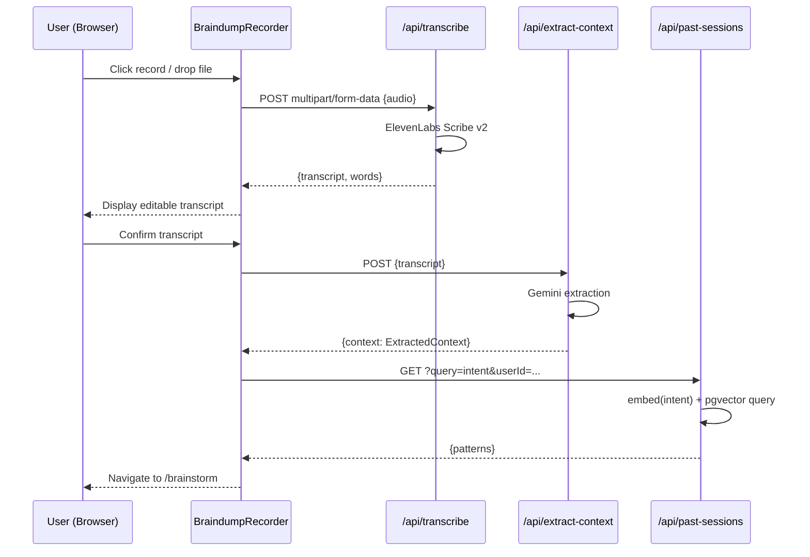
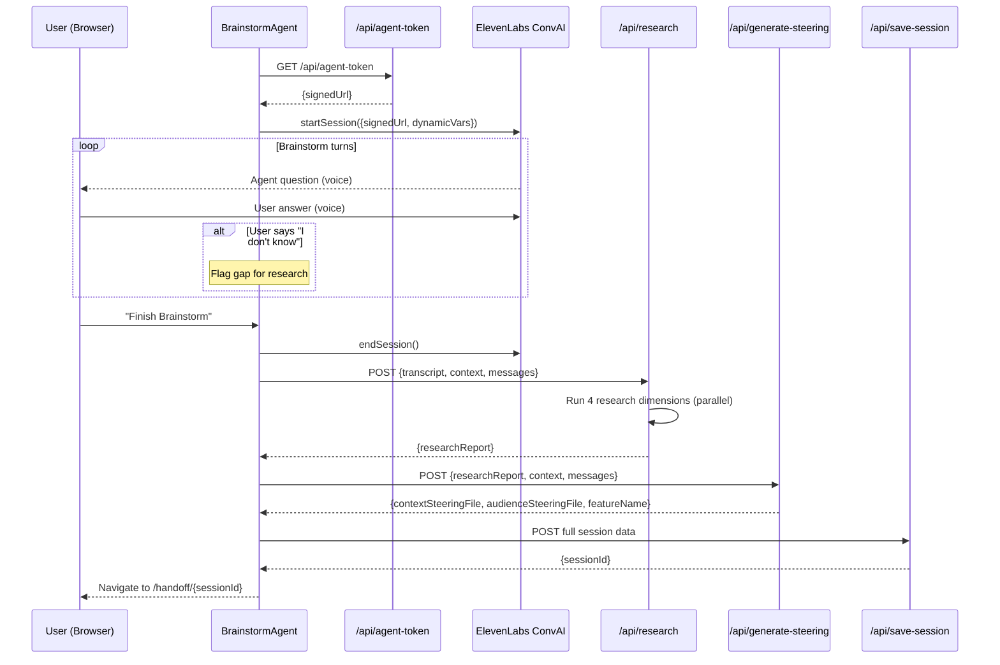
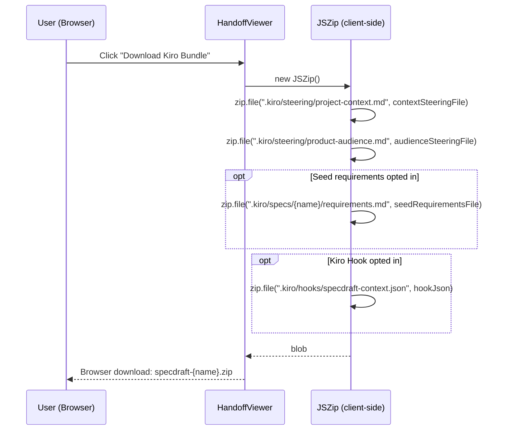

# Design Document — SpecDraft v2

## Overview

SpecDraft v2 is a voice-first AI brainstorm copilot built specifically for Kiro users. The user speaks freely about their product idea; an ElevenLabs ConvAI 2.0 agent steers the conversation following startup and product best practices; and after the conversation ends, automated background research fills any gaps the user could not answer. The output is a set of Kiro steering files and rich project context that makes every future Kiro session on that project smarter from day one.

The core architectural pivot from v1: instead of generating `requirements.md`, `design.md`, and `tasks.md` (which Kiro's own spec mode already produces), SpecDraft v2 generates the inputs that Kiro *cannot* produce for itself from a voice conversation — domain knowledge, startup-validated product decisions, competitive landscape, target audience profiles, and project-specific steering rules.

The existing scaffold (Next.js 16, React 19, Tailwind 4, ElevenLabs Scribe v2 + ConvAI 2.0, Google Gemini via `@google/genai`, NeonDB + pgvector + Drizzle ORM) is reused and extended.

---

## Architecture Overview

```
┌─────────────────────────────────────────────────────────────────┐
│                    NEXT.JS 16 APP (VERCEL)                       │
│                                                                 │
│  Pages (App Router)                                             │
│  ├── /                    ← Landing + Brain-Dump Intake         │
│  ├── /brainstorm          ← Startup-Methodology Brainstorm      │
│  └── /handoff/[sessionId] ← Kiro Steering Files Viewer         │
│                                                                 │
│  API Routes                                                     │
│  ├── POST /api/transcribe        (exists — reuse)               │
│  ├── POST /api/extract-context   (exists — reuse)               │
│  ├── GET  /api/agent-token       (exists — reuse)               │
│  ├── POST /api/gap-fill          (exists — reuse)               │
│  ├── POST /api/research          (new)                          │
│  ├── POST /api/generate-steering (new)                          │
│  ├── POST /api/save-session      (exists — extend)              │
│  ├── PATCH /api/save-session/[id] (new)                         │
│  └── GET  /api/past-sessions     (exists — reuse)               │
│                                                                 │
│  Components                                                     │
│  ├── BraindumpRecorder.tsx       (exists — reuse)               │
│  ├── FileUploadZone.tsx          (exists — reuse)               │
│  ├── WaveformVisualizer.tsx      (exists — reuse)               │
│  ├── BrainstormAgent.tsx         (new — adapted from Interview) │
│  ├── ResearchProgress.tsx        (new)                          │
│  └── HandoffViewer.tsx           (new)                          │
│                                                                 │
│  Lib                                                            │
│  ├── gemini.ts                   (exists — reuse)               │
│  ├── elevenlabs.ts               (exists — reuse)               │
│  ├── embeddings.ts               (exists — reuse)               │
│  ├── research-pipeline.ts        (new)                          │
│  └── steering-generator.ts       (new)                          │
└──────────────────┬──────────────────────────────────────────────┘
                   │
     ┌─────────────┼──────────────┐
     │             │              │
┌────▼───────┐ ┌───▼──────┐ ┌────▼──────────────┐
│ ElevenLabs │ │  Gemini  │ │ NeonDB (Postgres)  │
│ Scribe v2  │ │ @google/ │ │ + pgvector         │
│ ConvAI 2.0 │ │  genai   │ │ + Drizzle ORM      │
└────────────┘ └──────────┘ └───────────────────┘
```

---

## Technology Decisions

| Concern | Choice | Rationale |
|---|---|---|
| LLM + Embeddings | `@google/genai` (Gemini) | Already installed; `text-embedding-004` produces 768-dim vectors matching the existing schema |
| STT | ElevenLabs Scribe v2 | Already integrated in `/api/transcribe` |
| Voice Brainstorm | ElevenLabs ConvAI 2.0 + `@elevenlabs/react` | Provides `useConversation` hook with signed URL auth |
| Database | NeonDB + pgvector + Drizzle ORM | Already configured; pgvector enables cosine similarity RAG |
| Markdown Rendering | `react-markdown` | Already installed; lightweight, React 19 compatible |
| File Upload | `react-dropzone` | Already installed; handles drag-and-drop + file input with MIME validation |
| Zip Generation | `jszip` | Already installed; client-side zip for Kiro handoff bundle download |
| Styling | Tailwind 4 | Already installed |
| Deployment | Vercel | Serverless functions map directly to App Router API routes |

---

## Data Models

### Session (NeonDB — extended schema)

```typescript
// db/schema.ts — extend existing table with new columns
export const sessions = pgTable("sessions", {
  id: serial("id").primaryKey(),
  userId: text("user_id"),
  
  // v1 columns (keep for backward compatibility)
  braindumpTranscript: text("braindump_transcript"),
  extractedContext: jsonb("extracted_context"),
  interviewTranscript: jsonb("interview_transcript"),      // deprecated in v2
  prdMarkdown: text("prd_markdown"),                       // deprecated in v2
  kiroRequirements: text("kiro_requirements"),             // deprecated in v2
  kiroDesign: text("kiro_design"),                         // deprecated in v2
  kiroTasks: text("kiro_tasks"),                           // deprecated in v2
  
  // v2 columns (new)
  brainstormTranscript: jsonb("brainstorm_transcript"),    // BrainstormMessage[]
  researchReport: jsonb("research_report"),                // ResearchReport object
  contextSteeringFile: text("context_steering_file"),      // project-context.md content
  audienceSteeringFile: text("audience_steering_file"),    // product-audience.md content
  seedRequirementsFile: text("seed_requirements_file"),    // optional requirements.md
  
  // Shared
  embedding: vector("embedding", { dimensions: 768 }),     // Gemini text-embedding-004
  createdAt: timestamp("created_at").defaultNow(),
});
```

### ExtractedContext (TypeScript interface — unchanged from v1)

```typescript
interface ExtractedContext {
  intent: string;                  // one-sentence summary
  domain: string;                  // industry/category
  target_user_hints: string[];
  problem_hints: string[];
  constraints: string[];
  gaps: string[];                  // unanswered critical questions
  confidence: "low" | "medium" | "high";
}
```

### BrainstormMessage (TypeScript interface — replaces InterviewMessage)

```typescript
interface BrainstormMessage {
  role: "agent" | "user";
  message: string;
  timestamp: string;               // ISO 8601
  gapFlagged?: string;             // if this message flagged a gap for research
}
```

### ResearchReport (TypeScript interface — new)

```typescript
interface ResearchReport {
  competitors: Competitor[];
  targetAudience: AudienceSegment[];
  antiPersonas: AntiPersona[];
  marketSize: MarketSize | null;
  architectureRecommendations: ArchitectureRecommendation[];
  resolvedGaps: ResolvedGap[];
}

interface Competitor {
  name: string;
  positioning: string;
  targetAudience: string;
  differentiator: string;
  pricingModel: string;
}

interface AudienceSegment {
  segment: string;
  description: string;
  painPoints: string[];
  jobToBeDone: string;
  willingnessToPay: "high" | "medium" | "low";
  willingnessToPayRationale: string;
  channels: string[];
}

interface AntiPersona {
  name: string;
  reason: string;
}

interface MarketSize {
  tam: string;                     // e.g. "$2B–$5B"
  sam: string;
  som: string;
  methodology: string;
  confidence: "high" | "medium" | "low";
}

interface ArchitectureRecommendation {
  concern: string;                 // e.g. "Technology Stack"
  recommendation: string;
  rationale: string;
}

interface ResolvedGap {
  gap: string;
  finding: string;
  confidence: "high" | "medium" | "low";
}
```

### ClientSessionState (TypeScript interface — updated for v2)

```typescript
interface ClientSessionState {
  sessionId?: number;              // set after /api/save-session
  userId: string;                  // anonymous UUID from localStorage
  transcript: string;
  extractedContext: ExtractedContext;
  brainstormMessages: BrainstormMessage[];
  researchReport?: ResearchReport;
  contextSteeringFile?: string;
  audienceSteeringFile?: string;
  seedRequirementsFile?: string;
  featureName?: string;            // kebab-case slug derived from intent
}
```

---

## Component Architecture

### Page: `/` — Landing + Brain-Dump Intake

```
app/page.tsx  (Server Component shell)
└── BraindumpPage  (Client Component — "use client")
    ├── Hero section (3-step flow visual)
    ├── BraindumpRecorder.tsx  (reuse from v1)
    │   └── WaveformVisualizer.tsx  (reuse from v1)
    └── FileUploadZone.tsx  (reuse from v1)
```

**State machine:**
```
idle → recording → processing → transcribed → navigating
     ↑                                      ↓
     └──────────── uploading ───────────────┘
```

### Page: `/brainstorm` — Startup-Methodology Brainstorm

```
app/brainstorm/page.tsx  (Server Component shell)
└── BrainstormPage  (Client Component — "use client")
    ├── BrainstormAgent.tsx  (adapted from InterviewAgent)
    │   ├── Voice mode: useConversation hook + mic button
    │   └── Text fallback: message input + chat log
    ├── ResearchProgress.tsx  (shown after brainstorm ends)
    └── Progress indicator (topics covered)
```

### Page: `/handoff/[sessionId]` — Kiro Handoff Viewer

```
app/handoff/[sessionId]/page.tsx  (Server Component — fetches from DB)
└── HandoffViewer.tsx  (Client Component — "use client")
    ├── Session summary card
    ├── Tabbed file viewer
    │   ├── Tab: project-context.md
    │   ├── Tab: product-audience.md
    │   └── Tab: requirements.md (if opted in)
    ├── Per-file controls (preview, edit, copy, download)
    └── Export toolbar
        ├── Download Kiro Bundle button
        └── Save Changes button (if edited)
```

---

## API Route Designs

### `POST /api/research` (new)

**Purpose:** Runs the full Background_Research pipeline after the brainstorm conversation ends.

**Request:**
```typescript
{
  transcript: string;
  extractedContext: ExtractedContext;
  brainstormMessages: BrainstormMessage[];
}
```

**Processing:**
1. Extract all flagged gaps from `brainstormMessages`
2. Run 4 research dimensions in parallel via `Promise.all`:
   - Competitor analysis (Gemini + Google Search)
   - Target audience profiling (Gemini)
   - Market sizing (Gemini)
   - Architecture recommendations (Gemini)
3. Catch failures per-dimension; mark as `unresolved` rather than failing entire request
4. Assemble `ResearchReport` object
5. Return within 60-second timeout; if exceeded, return partial results

**Response:**
```typescript
{
  researchReport: ResearchReport;
  duration: number;  // milliseconds
}
// or
{ error: string }  // HTTP 500
```

**Implementation notes:**
- Delegates to `lib/research-pipeline.ts` → `runResearch()`
- Each dimension uses Gemini `gemini-2.0-flash` with Google Search grounding enabled
- Timeout handled via `Promise.race` with a 60-second timer

---

### `POST /api/generate-steering` (new)

**Purpose:** Generates the two Kiro steering files (and optionally a seed requirements file) from the research report.

**Request:**
```typescript
{
  researchReport: ResearchReport;
  extractedContext: ExtractedContext;
  brainstormMessages: BrainstormMessage[];
  generateSeedRequirements: boolean;  // opt-in flag
}
```

**Processing:**
1. Call `lib/steering-generator.ts` → `generateContextSteering()`
2. Call `lib/steering-generator.ts` → `generateAudienceSteering()`
3. If `generateSeedRequirements === true`, call `generateSeedRequirements()`
4. Prepend YAML front-matter (`---\ninclusion: always\n---\n`) to each steering file
5. Return all generated markdown strings

**Response:**
```typescript
{
  contextSteeringFile: string;
  audienceSteeringFile: string;
  seedRequirementsFile?: string;
  featureName: string;  // kebab-case slug from intent
}
// or
{ error: string }  // HTTP 500
```

---

### `POST /api/save-session` (extended from v1)

**Purpose:** Persists a completed v2 session to NeonDB.

**Request (v2 fields):**
```typescript
{
  userId: string;
  braindumpTranscript: string;
  extractedContext: ExtractedContext;
  brainstormTranscript: BrainstormMessage[];
  researchReport: ResearchReport;
  contextSteeringFile: string;
  audienceSteeringFile: string;
  seedRequirementsFile?: string;
}
```

**Processing:**
1. Generate embedding: `embed(intent + " " + domain + " " + contextSteeringFile)`
2. Insert row into `sessions` table with v2 columns populated
3. Return `sessionId`

**Response:**
```typescript
{ sessionId: number }
// or
{ error: string }  // HTTP 500
```

**Backward compatibility:** v1 columns (`prdMarkdown`, `kiroRequirements`, etc.) are left `NULL` for v2 sessions.

---

### `PATCH /api/save-session/[sessionId]` (new)

**Purpose:** Updates an existing session's steering file content after inline editing in HandoffViewer.

**Request:**
```typescript
{
  contextSteeringFile?: string;
  audienceSteeringFile?: string;
  seedRequirementsFile?: string;
}
```

**Processing:**
1. Validate `sessionId` exists in DB
2. Update only the provided fields
3. Return success

**Response:**
```typescript
{ success: true }
// or
{ error: string }  // HTTP 404 / 500
```

---

## Library Modules

### `lib/research-pipeline.ts` (new)

```typescript
export async function runResearch(params: {
  transcript: string;
  extractedContext: ExtractedContext;
  brainstormMessages: BrainstormMessage[];
}): Promise<ResearchReport>
```

**Implementation:**
- Runs 4 research dimensions in parallel via `Promise.all`
- Each dimension is wrapped in a try-catch; failures are logged and marked `unresolved`
- Uses Gemini `gemini-2.0-flash` with `tools: [{ googleSearch: {} }]` for grounding
- Returns `ResearchReport` object

**Research dimensions:**
1. `analyzeCompetitors()` — identifies up to 5 competitors
2. `profileAudience()` — synthesizes up to 3 audience segments + anti-personas
3. `estimateMarketSize()` — produces TAM/SAM/SOM estimates
4. `recommendArchitecture()` — generates stack + scalability + security recommendations

---

### `lib/steering-generator.ts` (new)

```typescript
export async function generateContextSteering(params: {
  researchReport: ResearchReport;
  extractedContext: ExtractedContext;
  brainstormMessages: BrainstormMessage[];
}): Promise<string>

export async function generateAudienceSteering(params: {
  researchReport: ResearchReport;
  extractedContext: ExtractedContext;
}): Promise<string>

export async function generateSeedRequirements(params: {
  researchReport: ResearchReport;
  extractedContext: ExtractedContext;
  brainstormMessages: BrainstormMessage[];
}): Promise<string>

export function deriveFeatureName(intent: string): string
```

**Implementation:**
- Each function calls Gemini `gemini-2.0-flash` with a structured prompt
- Returns raw markdown content (front-matter is prepended by the caller)
- `deriveFeatureName()` converts intent to kebab-case slug

---

## Key Flows (Sequence Diagrams)

### Flow 1: Brain-Dump → Transcript → Brainstorm



### Flow 2: Brainstorm → Research → Steering Files → Handoff



### Flow 3: Handoff Bundle Export



---

## Gemini Prompts

### Research — Competitor Analysis

```
You are a product researcher. Identify up to 5 competitors for a product with this description:

Intent: {{intent}}
Domain: {{domain}}
Brainstorm context: {{extractedContext}}

For each competitor, provide:
- name: product name
- positioning: one-sentence positioning statement
- targetAudience: primary target audience
- differentiator: how this product differs from the user's idea
- pricingModel: pricing model if publicly known, otherwise "unknown"

Include both direct competitors (same problem, same audience) and indirect competitors (same audience, different solution).

If fewer than 2 competitors can be identified with reasonable confidence, note this as a signal that the user may be in a novel market.

Return ONLY valid JSON array, no markdown fences.
```

### Research — Target Audience Profiling

```
You are a product strategist. Based on this brainstorm session, synthesize up to 3 target audience segments:

Intent: {{intent}}
Domain: {{domain}}
Brainstorm Q&A: {{brainstormMessages}}
Extracted signals: {{extractedContext}}

For each segment provide:
- segment: segment name
- description: one-paragraph description
- painPoints: array of 3-5 pain points
- jobToBeDone: JTBD statement ("When I..., I want to..., so I can...")
- willingnessToPay: "high" | "medium" | "low"
- willingnessToPayRationale: one-sentence rationale
- channels: preferred channels to reach this audience

Also identify 1-2 anti-personas (user types explicitly out of scope to prevent scope creep).

Prioritize the user's direct knowledge from the brainstorm over generic research.

Return ONLY valid JSON with keys "segments" and "antiPersonas", no markdown fences.
```

### Research — Market Sizing

```
You are a market analyst. Estimate the market size for:

Intent: {{intent}}
Domain: {{domain}}
Target audience: {{targetAudience}}

Provide TAM (Total Addressable Market), SAM (Serviceable Addressable Market), and SOM (Serviceable Obtainable Market) as annual USD revenue opportunity with order-of-magnitude qualifiers (e.g. "$2B–$5B TAM").

Include:
- methodology: brief rationale citing the approach (e.g. bottom-up from audience segment size × willingness-to-pay)
- confidence: "high" | "medium" | "low" reflecting how well the brainstorm data supports the estimate

If confidence would be below low, return null figures with a note that market sizing requires further primary research.

Return ONLY valid JSON, no markdown fences.
```

### Research — Architecture Recommendations

```
You are a senior software architect advising a technical founder. Based on this product:

Intent: {{intent}}
Domain: {{domain}}
Constraints: {{constraints}}
Market scale: {{marketSize}}

Generate architecture recommendations covering:
- stack: recommended technology stack with rationale tied to constraints
- dataModel: key data model considerations
- scalability: approach appropriate to the market scale estimate
- integrations: key third-party integrations needed
- securityCompliance: security and compliance considerations relevant to this domain

Default to Next.js 16, React 19, Tailwind 4, NeonDB, Drizzle ORM unless constraints suggest otherwise.

Explicitly call out any constraints that conflict with the recommended stack and propose resolutions.

Write as directive guidance for an AI coding agent (Kiro), not as options for the user to choose from. Kiro needs a clear recommendation, not a menu.

Return ONLY valid JSON, no markdown fences.
```

### Steering File — Context (project-context.md)

```
You are a technical writer creating a Kiro steering file. This file will be automatically loaded by Kiro in every agent session for this project.

Write in clear, directive prose that an AI coding agent can act on directly. No marketing language.

Generate a project-context.md steering file with these sections:

1. **Project Overview** — one paragraph summarizing the product and its purpose
2. **Domain Knowledge** — key concepts, terminology, and constraints specific to the product's domain
3. **Validated Product Decisions** — decisions made during the brainstorm with the rationale and any research backing
4. **Architecture Recommendations** — technology choices and structural guidance derived from the research report
5. **Kiro Conventions** — project-specific rules for how Kiro should behave when working on this project (e.g. preferred patterns, naming conventions, out-of-scope areas)

Session data:
- Intent: {{intent}}
- Domain: {{domain}}
- Brainstorm Q&A: {{brainstormMessages}}
- Research Report: {{researchReport}}

If the research report contains unresolved dimensions, note those gaps explicitly so Kiro knows what is unknown.

Output ONLY the markdown content. Do NOT include YAML front-matter — it will be prepended automatically.
```

### Steering File — Audience (product-audience.md)

```
You are a product strategist creating a Kiro steering file. This file will be automatically loaded by Kiro in every agent session for this project.

Generate a product-audience.md steering file with these sections:

1. **Target Audience** — structured profiles for each audience segment identified in the research report, each with segment name, pain points, jobs-to-be-done, and willingness-to-pay signal
2. **Competitive Landscape** — a summary of each competitor from the research report with their positioning and key differentiator
3. **Product Positioning** — a one-sentence positioning statement derived from the brainstorm and research
4. **Anti-Personas** — user types the product is explicitly NOT built for, to prevent scope creep

Research Report: {{researchReport}}
Brainstorm context: {{extractedContext}}

Write so Kiro can use this to make product decisions — e.g. when generating UI copy, API design, or feature prioritization.

Output ONLY the markdown content. Do NOT include YAML front-matter — it will be prepended automatically.
```

### Steering File — Seed Requirements (optional)

```
You are a technical writer generating a Kiro-compatible requirements.md file as a starting point for Kiro spec mode refinement.

Output ONLY markdown. Use EARS-pattern requirements (THE system SHALL...) and GIVEN/WHEN/THEN acceptance criteria.
Include priority labels P0/P1/P2. Number requirements as Requirement 1, Requirement 2, etc.

Do NOT duplicate content already present in the steering files (project-context.md, product-audience.md). Focus on functional requirements and acceptance criteria only.

Include a header note: "Generated by SpecDraft v2 as a starting point. Refine in Kiro spec mode."

Session data:
- Intent: {{intent}}
- Domain: {{domain}}
- Brainstorm Q&A: {{brainstormMessages}}
- Research Report: {{researchReport}}

Output ONLY markdown content.
```

---

## Kiro Handoff Bundle Structure

The zip archive produced by the "Download Kiro Bundle" action has this exact internal layout:

```
specdraft-{feature-name}.zip
└── .kiro/
    ├── steering/
    │   ├── project-context.md    ← Context_Steering_File with front-matter
    │   └── product-audience.md   ← Audience_Steering_File with front-matter
    ├── specs/
    │   └── {feature-name}/
    │       └── requirements.md   ← Seed_Requirements_File (optional)
    └── hooks/
        └── specdraft-context.json ← Kiro_Hook (optional)
```

`{feature-name}` is derived from `ExtractedContext.intent` by:
1. Lowercasing the string
2. Replacing spaces and special characters with hyphens
3. Collapsing consecutive hyphens
4. Trimming leading/trailing hyphens
5. Falling back to `"my-feature"` if the result is empty

---

## Kiro Hook JSON Format

The generated hook file (`.kiro/hooks/specdraft-context.json`) follows this schema:

```json
{
  "name": "SpecDraft Project Context",
  "version": "1.0.0",
  "description": "Automatically loads SpecDraft-generated project context at session start",
  "when": {
    "type": "promptSubmit"
  },
  "then": {
    "type": "askAgent",
    "prompt": "Before responding, read and internalize the project context in .kiro/steering/project-context.md and .kiro/steering/product-audience.md. These files contain validated product decisions, domain knowledge, and target audience profiles that should inform all your responses."
  }
}
```

---

## Steering File Front-Matter

Both steering files must start with YAML front-matter to enable automatic inclusion:

```markdown
---
inclusion: always
---

# Project Context

...
```

This front-matter block instructs Kiro to automatically load the file in every agent session.

---

## Session State & Routing

Client-side session state is passed between pages via `localStorage` (for large objects like transcript and brainstorm messages) and URL parameters (for `sessionId`).

```
/ (intake)
  → on transcription complete: store {transcript, extractedContext, userId} in localStorage under key "specdraft_v2_session"
  → navigate to /brainstorm

/brainstorm
  → read {transcript, extractedContext, userId} from localStorage
  → on brainstorm complete: run research pipeline, generate steering files
  → store {researchReport, contextSteeringFile, audienceSteeringFile, featureName} in localStorage
  → call /api/save-session
  → navigate to /handoff/{sessionId}

/handoff/[sessionId]
  → Server Component fetches session row from NeonDB by sessionId
  → Falls back to localStorage data if DB fetch fails (for immediate post-save view)
```

Anonymous `userId` is a UUID generated on first visit and persisted in `localStorage` under `"specdraft_user_id"`.

---

## Error Handling Strategy

| Layer | Strategy |
|---|---|
| API routes | Return `{ error: string }` with appropriate HTTP status; log to console |
| Missing env vars | Throw with variable name in message; caught by route handler → HTTP 500 |
| ElevenLabs ConvAI failure | Fall back to text chat mode; surface error in UI |
| Gemini API failure | Return HTTP 500; UI shows retry button |
| Research pipeline dimension failure | Catch per-dimension; mark as `unresolved` in ResearchReport; continue |
| Research pipeline timeout | Return partial results after 60 seconds; allow user to proceed |
| pgvector RAG failure | Log and proceed without pre-fill; non-blocking |
| DB write failure | Return HTTP 500; UI shows error with option to download files locally |
| MediaRecorder not supported | Detect on mount; show upload-only UI |
| Mic permission denied | Catch `getUserMedia` rejection; show upload-only UI |

---

## File Structure

```
app/
├── layout.tsx                     (update metadata for v2)
├── page.tsx                       (update landing page with 3-step flow)
├── brainstorm/
│   └── page.tsx                   (new — replaces /interview)