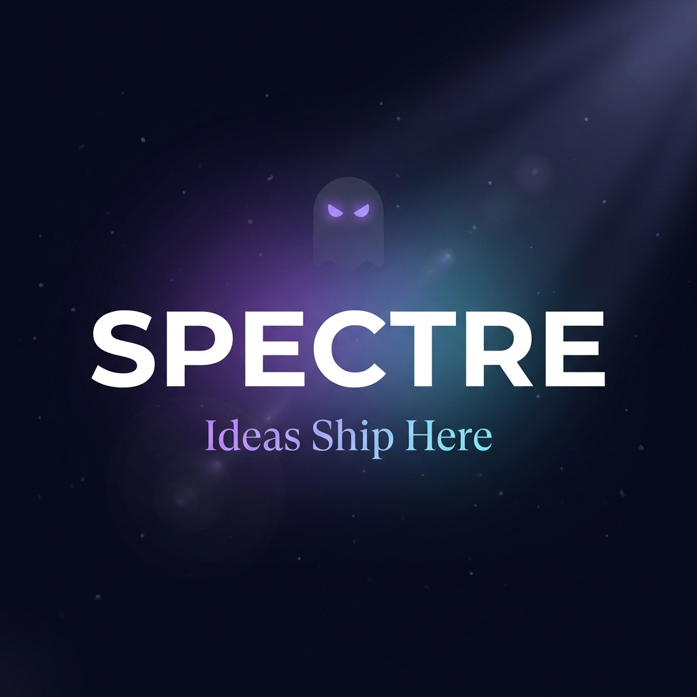

<p align="center">
  
</p>

<h1 align="center">👻 Spectre</h1>

<p align="center">
  <strong>Stop collecting ideas. Start shipping them.</strong><br/>
  Voice-first AI product copilot that turns a 2-minute ramble into a production-ready spec — ready to paste into <a href="https://kiro.dev">Kiro</a> and build.
</p>

<p align="center">
  <a href="#-demo">Demo</a> •
  <a href="#-the-problem">Problem</a> •
  <a href="#-how-it-works">How It Works</a> •
  <a href="#%EF%B8%8F-architecture">Architecture</a> •
  <a href="#-tech-stack">Tech Stack</a> •
  <a href="#-quickstart">Quickstart</a> •
  <a href="#-investment">Investment</a>
</p>

<p align="center">
  
  
  
  
  
  
</p>

<p align="center">
  <em>Built for the <a href="https://elevenlabs.io">ElevenLabs</a> × <a href="https://kiro.dev">Kiro</a> Hackathon — #ElevenHacks #CodeWithKiro</em>
</p>

---

## 🎬 Demo

> **[📺 Watch the demo video →](https://x.com/AGI_CEO/status/2047062315372081603)**
>
> *2-minute ramble → AI brainstorm → deep research → Kiro-ready spec bundle — all in one session.*

---

## 😤 The Problem

You have **50 ideas** and **zero shipped products**.

They live in a notes app, a voice memo folder, or worse — your head. Every one of them dies the same way: you sit down to "plan it out," open a blank doc, and stare at it until you decide to watch YouTube instead.

The gap between *raw idea* and *something an AI coding agent can actually build* is enormous. You need a PRD. User stories. Architecture decisions. Target audience research. Market validation. And you need it structured in a way that Kiro, Cursor, or Copilot can execute — not a rambling Google Doc.

**Spectre kills that gap in under 15 minutes.**

---

## ⚡ How It Works

```
┌──────────────────┐     ┌──────────────────┐     ┌──────────────────┐     ┌──────────────────┐
│   1. BRAIN-DUMP  │────▶│  2. BRAINSTORM   │────▶│   3. RESEARCH    │────▶│   4. HANDOFF     │
│                  │     │                  │     │                  │     │                  │
│  Record or upload│     │  Voice AI agent  │     │  5-dimension     │     │  Kiro steering   │
│  a voice note    │     │  asks the hard   │     │  parallel        │     │  files + seed    │
│  about your idea │     │  questions you   │     │  research via    │     │  requirements    │
│                  │     │  keep dodging    │     │  Gemini + Search │     │  as a .zip       │
└──────────────────┘     └──────────────────┘     └──────────────────┘     └──────────────────┘
```

### Step 1 → Brain-Dump Intake
Hit record and ramble about your idea like you're telling a friend at a bar. Or drop in that 3 AM voice memo you already have. **ElevenLabs Scribe v2** transcribes it with >95% accuracy, then **Gemini** extracts structured context — intent, domain, constraints, and critical knowledge gaps.

### Step 2 → AI Brainstorm Interview
An **ElevenLabs ConvAI 2.0** agent starts a voice conversation with you. It already knows what you said in the brain-dump — so it skips the obvious and goes straight for the hard questions:

- *Who exactly is this for?*
- *What does winning look like in 90 days?*
- *What happens when the user says "I don't know"?*

When you say **"I don't know"** — Spectre doesn't judge. It flags the gap and queues it for automated research.

### Step 3 → Deep Research Pipeline
Five research dimensions run **in parallel** via Google Gemini with Search grounding:

| Dimension | What It Produces |
|---|---|
| 🏢 **Competitor Analysis** | Up to 5 competitors with positioning, differentiators, and pricing models |
| 👥 **Audience Profiling** | Structured segments with pain points, JTBD statements, and willingness-to-pay signals |
| 📊 **Market Sizing** | TAM / SAM / SOM estimates with methodology and confidence levels |
| 🏗️ **Architecture Recs** | Tech stack guidance tuned to your constraints — written as directives for Kiro |
| 🔍 **Gap Resolution** | Research-backed answers for every "I don't know" from the brainstorm |

### Step 4 → Kiro-Ready Handoff
Spectre outputs a downloadable **.zip bundle** structured for Kiro's spec-driven development:

```
.kiro/
├── steering/
│   ├── project-context.md      # Domain knowledge, validated decisions, architecture
│   └── product-audience.md     # Audience profiles, competitive landscape, positioning
├── specs/
│   └── <feature-name>/
│       └── requirements.md     # EARS-pattern requirements with GIVEN/WHEN/THEN
└── hooks/
    └── specdraft-context.json  # Auto-loads context on every Kiro prompt
```

**Paste it into your project root. Open Kiro. Start building.** Every session is embedded via pgvector and stored — so Spectre gets smarter with every idea you throw at it.

---

## 🏗️ Architecture

```
┌─────────────────────────────────────────────────────────────────────┐
│                        NEXT.JS 16 APP (VERCEL)                      │
│                                                                     │
│  PAGES                              API ROUTES                      │
│  ├── /              Landing +       ├── /api/transcribe              │
│  │                  Brain-dump UI   │     ElevenLabs Scribe v2 STT   │
│  ├── /brainstorm    ConvAI voice    ├── /api/extract-context         │
│  │                  interview       │     Gemini context extraction   │
│  └── /handoff/:id   Kiro bundle     ├── /api/agent-token             │
│                     preview +       │     ConvAI signed URL auth      │
│                     download        ├── /api/research                 │
│                                     │     5-dimension parallel pipe   │
│  COMPONENTS                         ├── /api/generate-steering       │
│  ├── BraindumpRecorder              │     Kiro steering file gen      │
│  ├── BrainstormAgent                ├── /api/save-session             │
│  ├── FileUploadZone                 │     NeonDB + pgvector embed     │
│  ├── HandoffViewer                  └── /api/past-sessions            │
│  ├── ResearchProgress                     RAG retrieval (cosine sim)  │
│  └── WaveformVisualizer                                              │
│                                                                     │
└──────────────────────────────┬──────────────────────────────────────┘
                               │
              ┌────────────────┼──────────────────┐
              │                │                  │
    ┌─────────▼──────┐  ┌─────▼───────┐  ┌──────▼─────────────┐
    │ ElevenLabs     │  │ Google      │  │ NeonDB (Postgres)   │
    │ • Scribe v2    │  │ Gemini      │  │ • pgvector (768-dim)│
    │   (STT)        │  │ • 3.1 Flash │  │ • Drizzle ORM       │
    │ • ConvAI 2.0   │  │   Lite      │  │ • IVFFlat index     │
    │   (voice agent)│  │ • Search    │  │ • Cross-session RAG │
    └────────────────┘  │   grounding │  └────────────────────┘
                        └─────────────┘
```

---

## 🧰 Tech Stack

| Layer | Technology | Why |
|---|---|---|
| **Framework** | Next.js 16, React 19 | App Router + server components for API routes |
| **Voice Transcription** | ElevenLabs Scribe v2 | Best-in-class STT with >95% accuracy |
| **Voice AI Agent** | ElevenLabs ConvAI 2.0 | Real-time conversational AI with dynamic variables |
| **LLM / Research** | Google Gemini 3.1 Flash Lite | Fast inference + Google Search grounding for real-time research |
| **Embeddings** | Gemini text-embedding (768d) | Semantic embeddings for cross-session RAG |
| **Database** | NeonDB + pgvector | Serverless Postgres with vector similarity search |
| **ORM** | Drizzle ORM | Type-safe schema + migrations |
| **Styling** | Tailwind CSS 4 | Utility-first styling with custom design system |
| **Export** | JSZip | Client-side Kiro bundle generation |
| **IDE Integration** | Kiro spec-driven development | Steering files + hooks for agentic coding |

---

## 🚀 Quickstart

### Prerequisites

- **Node.js 18+**
- [ElevenLabs](https://elevenlabs.io) account (API key + ConvAI agent configured)
- [Google AI Studio](https://aistudio.google.com) account (Gemini API key)
- [NeonDB](https://neon.tech) account (free tier works)

### Setup

```bash
# Clone
git clone https://github.com/AGI-CEO/spectre.git
cd spectre

# Install
npm install

# Configure environment
cp .env.example .env
# Fill in your API keys (see table below)

# Run database migrations
npx drizzle-kit push

# Start dev server
npm run dev
```

Open **http://localhost:3000** and ship your first idea.

### Environment Variables

| Variable | Description |
|---|---|
| `ELEVENLABS_API_KEY` | ElevenLabs API key for Scribe v2 + ConvAI |
| `ELEVENLABS_AGENT_ID` | ConvAI agent ID from ElevenLabs dashboard |
| `GEMINI_API_KEY` | Google Gemini API key for LLM + embeddings |
| `DATABASE_URL` | Neon pooled connection string |
| `DATABASE_URL_UNPOOLED` | Neon direct connection (migrations) |
| `NEXT_PUBLIC_APP_URL` | Public URL (e.g. `http://localhost:3000`) |

---

## 📁 Project Structure

```
spectre/
├── app/
│   ├── page.tsx                    # Landing — animated hero + brain-dump funnel
│   ├── brainstorm/page.tsx         # ConvAI voice brainstorm + text fallback
│   ├── handoff/[sessionId]/        # Kiro bundle viewer + editor + export
│   └── api/
│       ├── transcribe/             # ElevenLabs Scribe v2 STT
│       ├── extract-context/        # Gemini context extraction
│       ├── agent-token/            # ConvAI signed URL generation
│       ├── research/               # 5-dimension parallel research pipeline
│       ├── generate-steering/      # Kiro steering file generation
│       ├── save-session/           # NeonDB + pgvector persistence
│       └── past-sessions/          # RAG retrieval for cross-session learning
├── components/
│   ├── BraindumpRecorder.tsx       # MediaRecorder + live waveform
│   ├── BrainstormAgent.tsx         # ElevenLabs ConvAI React integration
│   ├── FileUploadZone.tsx          # Drag-drop audio upload
│   ├── HandoffViewer.tsx           # Tabbed markdown editor + bundle export
│   ├── ResearchProgress.tsx        # Animated research status indicator
│   └── WaveformVisualizer.tsx      # Real-time audio waveform
├── lib/
│   ├── research-pipeline.ts        # Competitor, audience, market, arch, gap analysis
│   ├── steering-generator.ts       # Kiro steering + requirements file generation
│   ├── prd-assembler.ts            # PRD markdown assembly pipeline
│   ├── kiro-spec-generator.ts      # requirements.md / design.md / tasks.md builder
│   ├── embeddings.ts               # Gemini embedding + RAG helpers
│   └── types.ts                    # Full TypeScript type system
├── db/
│   ├── schema.ts                   # Drizzle schema with pgvector (768-dim)
│   └── index.ts                    # Neon serverless client
└── .kiro/
    └── specs/                      # Kiro spec files for this project
```

---

## 🎯 Hackathon Criteria

### ✅ Spec-Driven Development
Spectre was built using Kiro's spec-driven approach. The entire project was scaffolded from a [detailed PRD](specdraft-prd.md) that defined every requirement, API contract, and database schema before a single line of code was written. The `.kiro/specs/` directory contains the original spec files that guided development.

### ✅ Creative Use of ElevenLabs APIs
Spectre uses **three** ElevenLabs products in a single pipeline:
1. **Scribe v2** — Transcribes raw brain-dump audio with high accuracy
2. **ConvAI 2.0** — Powers the real-time voice brainstorm interview agent
3. **React SDK** — `useConversation` hook with dynamic variable injection for context-aware interviews

### ✅ Real-World Problem, Real-World Solution
This isn't a toy demo. Spectre solves the #1 bottleneck in AI-assisted development: turning unstructured ideas into structured specifications that AI coding agents can execute reliably.

---

## 💰 Investment

<table>
  <tr>
    <td width="200"><strong>Seeking</strong></td>
    <td><strong>$10,000</strong> for <strong>10% ownership</strong></td>
  </tr>
  <tr>
    <td><strong>Valuation</strong></td>
    <td>$100K pre-money</td>
  </tr>
  <tr>
    <td><strong>Use of Funds</strong></td>
    <td>
      <strong>Infrastructure</strong> — Production database, ElevenLabs Scale plan, Vercel Pro<br/>
      <strong>Product</strong> — User auth, team collaboration, session history dashboard<br/>
      <strong>Growth</strong> — Content marketing, indie hacker community outreach, Product Hunt launch
    </td>
  </tr>
  <tr>
    <td><strong>Market</strong></td>
    <td>$15B+ developer tools market. 30M+ developers now use AI coding assistants — every one of them needs a better way to go from idea → spec.</td>
  </tr>
  <tr>
    <td><strong>Traction</strong></td>
    <td>Working product, hackathon submission, spec-driven development proven end-to-end</td>
  </tr>
</table>

### Why Now?
AI coding agents (Kiro, Cursor, Windsurf, Copilot) are exploding — but they all choke on vague instructions. The better the spec, the better the output. **Spectre is the spec layer the AI coding revolution is missing.**

### Roadmap

| Phase | Timeline | Deliverables |
|---|---|---|
| **🏗️ Foundation** | Now | Voice intake, AI brainstorm, research pipeline, Kiro bundle export |
| **👤 Identity** | Month 1 | User auth, persistent session history, dashboard |
| **🤝 Teams** | Month 2 | Shared workspaces, collaborative brainstorming, role-based access |
| **🔌 Integrations** | Month 3 | Direct Kiro plugin, GitHub integration, Notion/Linear export |
| **💳 Monetization** | Month 4 | Freemium model — 3 free sessions/month, $19/mo Pro, $49/mo Team |

---

## 🏆 Hackathon Info

**Competition:** ElevenLabs × Kiro Hackathon (#ElevenHacks)

**Prizes:** $11,980 total — $5,000 + ElevenLabs Scale (1st), $3,000 + Scale (2nd), $2,000 + Scale (3rd)

**Socials:** [@kirodotdev](https://twitter.com/kirodotdev) • [@elevenlabsio](https://twitter.com/elevenlabsio)

**Hashtags:** `#ElevenHacks` `#CodeWithKiro`

---

## 📜 License

MIT © 2026

---

<p align="center">
  <br/>
  <strong>👻 Spectre — Ideas Ship Here</strong><br/>
  <em>Stop planning. Start shipping.</em>
</p>
